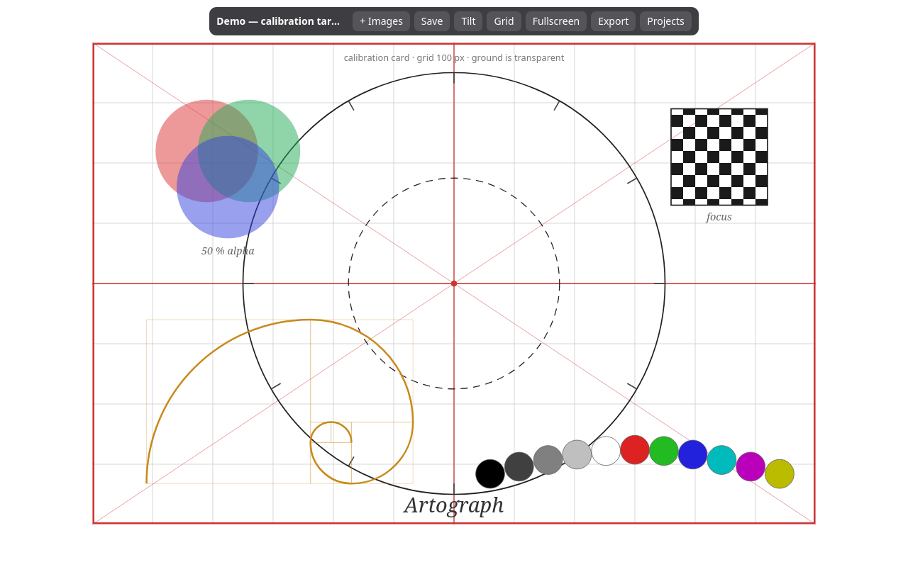
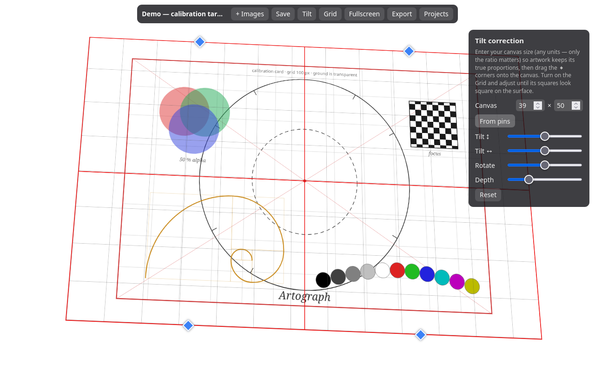

# Artograph

A browser-based **art projector** for tracing. Drop reference images onto a white
page, arrange and scale them, project the page onto a wall or canvas, correct for
a tilted projection surface, and trace. Your arrangement is frozen into a project
that reopens in exactly the same state.

No server, no account, no install: the production build is a **single HTML file**.
All data stays in your browser.

**Use it now: <https://sergeymokhov.github.io/artograph/>**



## Quick start

Open <https://sergeymokhov.github.io/artograph/> (auto-deployed from `main`),
build the single file yourself (see [Development](#development)) and open
`dist/index.html` in a browser, or serve the repo with `yarn dev`.

1. **New project** → name it. (A **Demo — calibration target** project is
   created automatically on first run: a transparent SVG test card with a
   100 px grid, circles, focus checkerboard, and gray/color bars for dialing
   in the projector. It has a ↺ Reset button in the project list instead of
   Delete, so you can always restore it to its original state.)
2. **Add images**: click `+ Images`, or drag & drop files onto the page, or paste
   from the clipboard. PNG/SVG transparency is respected — alpha regions show
   whatever is underneath.
3. **Arrange**: drag to move; mouse-wheel over an image to scale it around the
   cursor; use the corner handles to resize and the round top handle to rotate
   (hold <kbd>Shift</kbd> to snap to 15°). Selected images get opacity and
   z-order controls in the toolbar. Once an image sits right, **freeze it in
   place** (🔓 button or <kbd>L</kbd>) so you can't nudge it while arranging
   the others — frozen images show an amber dashed outline when selected and
   ignore move/scale/rotate/delete until unfrozen.
4. **Project & calibrate**: press <kbd>F</kbd> for fullscreen on the projector.
   Open **Tilt** (<kbd>T</kbd>), drag the four ◆ corner pins onto the canvas
   corners, then click **From pins** — the app infers the canvas's proportions
   from the pinned quad so artwork keeps its true shape (squares stay square)
   even on a canvas shaped differently from the screen. The inference assumes
   the projector faces the canvas roughly square-on; for exactness, type the
   measured canvas size into the **Canvas** field instead (any units — only the
   ratio matters, e.g. `60 × 80`). Fine-tune with the rotate/perspective
   sliders, and toggle the **Grid** (<kbd>G</kbd>) until its squares look square
   on the physical surface.
5. **Trace**: stop moving the mouse and all controls (and the cursor) disappear
   after 3 seconds, leaving a clean projection. Move the mouse to get them back.
6. **Save** writes the project immediately; the app also autosaves about a
   second after every change. Reopening the project restores positions, scale,
   and tilt exactly.



## Keyboard shortcuts

| Key | Action |
| --- | --- |
| <kbd>F</kbd> | Fullscreen |
| <kbd>G</kbd> | Calibration grid |
| <kbd>T</kbd> | Tilt-correction panel |
| <kbd>←→↑↓</kbd> | Nudge selected image 1 px (<kbd>Shift</kbd>: 10 px) |
| <kbd>[</kbd> / <kbd>]</kbd> | Send backward / bring forward |
| <kbd>L</kbd> | Freeze / unfreeze selected image in place |
| <kbd>Delete</kbd> | Remove selected image |
| <kbd>Esc</kbd> | Deselect |

## Projects and portability

Projects (including image data, deduplicated by content hash) live in the
browser's IndexedDB — they survive closing the tab or the browser, but they are
**per browser and per origin**. To back a project up or move it to another
machine/browser, use **Export** (toolbar, or the ⇩ button in the project list),
which downloads a self-contained `<name>.artograph` file; **Import .artograph**
on the project list brings it back, images included.

## How the tilt correction works

The whole composition lives in one full-viewport "stage" element. Tilt
compensation computes a 4-point projective homography (closed-form adjugate
solve, `src/homography.ts`) from the stage rectangle to the four pinned corners
and applies it as a single CSS `matrix3d` — GPU-composited, and the relative
geometry between images is preserved under the warp. The slider angles
(rotate X/Y/Z + perspective distance) and the per-corner pixel pins compose into
the same corner model, so both control styles cooperate. Pointer input is mapped
back through the inverse homography, so dragging images works while the stage
is warped.

## Development

```sh
yarn          # install dependencies
yarn dev      # dev server with hot reload
yarn test     # unit tests (homography math)
yarn build    # type-check + produce the single-file dist/index.html
```

Stack: [Vite](https://vite.dev) + vanilla TypeScript (strict), no framework, no
runtime dependencies beyond [idb-keyval](https://github.com/jakearchibald/idb-keyval).
The build inlines everything into `dist/index.html`
([vite-plugin-singlefile](https://github.com/richardtallent/vite-plugin-singlefile)),
so it runs from a `file://` URL.

| Module | Responsibility |
| --- | --- |
| `src/homography.ts` | 4-point homography ↔ `matrix3d` (pure, unit-tested) |
| `src/keystone.ts` | Tilt state → stage transform, corner pins, sliders |
| `src/stage.ts` | Layer rendering, image ingest, selection |
| `src/interactions.ts` | Pointer/wheel/keyboard editing |
| `src/store.ts` | IndexedDB persistence, content-hash image dedup + GC |
| `src/export.ts` | `.artograph` export/import |
| `src/main.ts` | Project picker, toolbar, autosave, projection mode |

End-to-end verification drives the real UI in Firefox via puppeteer-core:

```sh
yarn dev &
node scripts/verify-e2e.mjs
```

## Roadmap

- Image-editing tools for tracing (edge detection, posterize,
  brightness/contrast) as a Rust → WebAssembly module.
